# 搭建企业级 DevOps 平台

## 1、环境准备

| 主机名         | 主机IP         | 描述                         | 操作系统                    | 内核版本                          | 机器配置   |
| -------------- | -------------- | ---------------------------- | --------------------------- | --------------------------------- | ---------- |
| gitlab-31-24   | 192.168.31.24  | 使用docker部署gitlab         | Rocky Linux 9.0 (Blue Onyx) | Linux 5.14.0-70.13.1.el9_0.x86_64 | 8C 8G 100G |
| Jenkins-31-171 | 192.168.31.171 | 使用docker部署jenkins        | Rocky Linux 9.0 (Blue Onyx) | Linux 5.14.0-70.13.1.el9_0.x86_64 | 4C 4G 100G |
| k8s-31-54      | 192.168.31.54  | 使用kubeadm部署k8s单节点集群 | Rocky Linux 9.0 (Blue Onyx) | Linux 5.14.0-70.13.1.el9_0.x86_64 | 4C 4G 100G |

### 前置条件

关闭防火墙和selinux

~~~ shell
systemctl disable firewalld.service --now
sed -i 's@SELINUX=enabled@SELINUX=disabled@g' /etc/selinux/config
# 重启生效所以临时设置为宽容模式
setenforce 0
reboot
~~~

因为虚拟机采用的网络模式是桥接，为了防止IP自动分配，请手动设置IP地址。三台同样配置

~~~ shell
# Rocky 操作系统使用NetworkManager管理网卡，编辑网卡文件
vim /etc/NetworkManager/system-connections/ens33.nmconnection
[connection]
id=ens33
uuid=22b59732-7826-371f-8b8d-f20c5d47bcce
type=ethernet
autoconnect-priority=-999
interface-name=ens33
timestamp=1755509104

[ethernet]

[ipv4]
method=manual  # auto改为 manual，注意后面不能有空格
address=192.168.31.54/24,192.168.31.1  # IP地址/子网掩码,网关，注意后面不能有空格
dns=8.8.8.8  # DNS服务器，注意后面不能有空格

[ipv6]
addr-gen-mode=eui64
method=auto

[proxy]


# 保存退出，并重启网卡
nmcli connection reload && nmcli connection down ens33 && nmcli connection up ens33
~~~

### 部署目录

~~~ shell
/usr/local/
~~~

### 软件版本

| 组件               | 推荐版本      | 说明                                                         |
| ------------------ | ------------- | ------------------------------------------------------------ |
| **GitLab CE**      | `17.5.0-ce.0` | 你已经拉取的版本，当前 LTS，支持新功能和安全补丁。           |
| **Jenkins**        | `2.462.3 LTS` | Jenkins 官方 LTS 稳定分支，推荐企业用 LTS，而不是 weekly。   |
| **Harbor**         | `2.11.0`      | 最新稳定版，支持 OCI Artifact、Trivy 安全扫描，兼容 Docker 20+ 和 K8s 1.32。 |
| **SonarQube**      | `10.6.0 LTS`  | 长期支持版本，兼容 JDK 17+，适合和 Jenkins Pipeline 集成。   |
| **Maven**          | `3.8.9`       | 最新稳定版（不是 3.8.5，官方已更新到 3.8.8），修复了 3.8.5 的部分依赖解析问题。 |
| **OpenJDK**        | `17` (LTS)    | 建议使用 JDK 17（目前的 LTS，支持到 2029），Maven 3.8.x、Jenkins、SonarQube 都兼容；不建议 JDK 21（太新，部分插件未完全适配）。 |
| **Kubernetes**     | `1.32.8`      | 你已安装，属最新稳定分支。                                   |
| **Docker CE**      | `28.3.3`      | 你已安装，OK。                                               |
| **docker-compose** | `v2.27.0`     | 你已安装，OK。                                               |

## 2、安装Docker

### 配置YUM源

1. 配置yum源

```bash
（1）确认文件是否存在且可读
sudo cat /etc/yum.repos.d/rocky.repo
如果文件不存在或内容为空，重新创建它。

（2）重新下载正确的阿里云源文件
sudo rm -f /etc/yum.repos.d/rocky.repo  # 删除旧文件（如果有）
sudo curl -o /etc/yum.repos.d/rocky.repo https://mirrors.aliyun.com/rockylinux/rocky.repo?repo=rocky-9
（3）手动编辑文件（如果下载失败）
sudo vi /etc/yum.repos.d/rocky.repo
粘贴以下内容（阿里云 Rocky Linux 9 镜像源）：
[baseos]
name=Rocky Linux $releasever - BaseOS - Aliyun
baseurl=https://mirrors.aliyun.com/rockylinux/$releasever/BaseOS/$basearch/os/
gpgcheck=1
enabled=1
gpgkey=file:///etc/pki/rpm-gpg/RPM-GPG-KEY-rockyofficial

[appstream]
name=Rocky Linux $releasever - AppStream - Aliyun
baseurl=https://mirrors.aliyun.com/rockylinux/$releasever/AppStream/$basearch/os/
gpgcheck=1
enabled=1
gpgkey=file:///etc/pki/rpm-gpg/RPM-GPG-KEY-rockyofficial

[extras]
name=Rocky Linux $releasever - Extras - Aliyun
baseurl=https://mirrors.aliyun.com/rockylinux/$releasever/extras/$basearch/os/
gpgcheck=1
enabled=1
gpgkey=file:///etc/pki/rpm-gpg/RPM-GPG-KEY-rockyofficial


（4）也可以直接替换yum源里的地址
sed -e 's|^mirrorlist=|#mirrorlist=|g' \
    -e 's|^#baseurl=http://dl.rockylinux.org/$contentdir|baseurl=https://mirrors.aliyun.com/rockylinux|g' \
    -i.bak \
    /etc/yum.repos.d/rocky*.repo
```


2. 强制替换变量为 Rocky Linux 9
确保 $releasever 和 $basearch 被正确解析：

```bash
sudo sed -i 's/$releasever/9/g' /etc/yum.repos.d/rocky.repo
sudo sed -i 's/$basearch/x86_64/g' /etc/yum.repos.d/rocky.repo  # 如果是 x86_64 架构
```


3. 导入 GPG 密钥

  ```bash
sudo rpm --import https://mirrors.aliyun.com/rockylinux/RPM-GPG-KEY-rockyofficial
  ```

4. 检查文件权限和格式
    （1）确保文件权限正确
    
    ```bash
    sudo chmod 644 /etc/yum.repos.d/rocky.repo
    ```
    

（2）检查文件格式（避免 UTF-8 BOM 或 Windows 换行符）
    
    ```bash
    sudo dos2unix /etc/yum.repos.d/rocky.repo  # 如果是从 Windows 复制的文件
    ```
    
    清除缓存并重新加载

  ```bash
sudo dnf clean all
sudo dnf makecache
  ```

6. 验证仓库是否启用

  ```bash
sudo dnf repolist
正常输出应类似：
text
repo id                          repo name
baseos                           Rocky Linux 9 - BaseOS - Aliyun
appstream                        Rocky Linux 9 - AppStream - Aliyun
extras                           Rocky Linux 9 - Extras - Aliyun
  ```

在 Rocky Linux 9 中启用并安装 EPEL Repo。

```sql
dnf install epel-release
```

 备份(如有配置其他epel源)并替换为国内镜像
注意最后这个库，阿里云没有对应的镜像，不要修改它，如果误改恢复原版源即可

```cobol
cp /etc/yum.repos.d/epel.repo  /etc/yum.repos.d/epel.repo.backup 
cp /etc/yum.repos.d/epel-testing.repo  /etc/yum.repos.d/epel-testing.repo.backup
cp /etc/yum.repos.d/epel-cisco-openh264.repo  /etc/yum.repos.d/epel-cisco-openh264.repo.backup
```

将 repo 配置中的地址替换为阿里云镜像站地址

执行下面语句，它会替换epel.repo、eple-testing.repo中的网址，不会修改epel-cisco-openh264.repo，可以正常使用。

```cobol
sed -e 's!^metalink=!#metalink=!g' \
    -e 's!^#baseurl=!baseurl=!g' \
    -e 's!https\?://download\.fedoraproject\.org/pub/epel!https://mirrors.aliyun.com/epel!g' \
    -e 's!https\?://download\.example/pub/epel!https://mirrors.aliyun.com/epel!g' \
    -i /etc/yum.repos.d/epel{,-testing}.repo
```

更新仓库缓存

```sql
dnf clean all 
dnf makecache   ---生成缓存，安装软件更快
```

### 查看docker版本

~~~ shell
# Step 1: 安装依赖
yum install -y yum-utils device-mapper-persistent-data lvm2
 
# Step 2: 添加软件源信息
yum-config-manager --add-repo https://mirrors.aliyun.com/docker-ce/linux/rhel/docker-ce.repo

# Step 3: 安装Docker-CE，查询安装的版本
dnf list docker-ce --showduplicates | sort -r

docker-ce.x86_64                 3:28.3.3-1.el9                 docker-ce-stable
docker-ce.x86_64                 3:28.3.2-1.el9                 docker-ce-stable
docker-ce.x86_64                 3:28.3.1-1.el9                 docker-ce-stable
docker-ce.x86_64                 3:28.3.0-1.el9                 docker-ce-stable

# dnf install docker-ce-<VERSION_STRING> docker-ce-cli-<VERSION_STRING> containerd.io docker-buildx-plugin docker-compose-plugin
dnf install docker-ce-28.3.3 docker-ce-cli-28.3.3 containerd.io docker-buildx-plugin docker-compose-plugin -y
 
# docker -v
Docker version 28.3.3, build 980b856
 
# 设置国内镜像加速
mkdir -p /etc/docker/ 
cat  >> /etc/docker/daemon.json << EOF
{
   "registry-mirrors":["https://p3kgr6db.mirror.aliyuncs.com",
   "https://docker.m.daocloud.io",
   "https://your_id.mirror.aliyuncs.com",
   "https://docker.nju.edu.cn/",
    "https://docker.anyhub.us.kg",
    "https://dockerhub.jobcher.com",
    "https://dockerhub.icu",
    "https://docker.ckyl.me",
       "https://cr.console.aliyun.com"
   ],
"exec-opts": ["native.cgroupdriver=systemd"]
}
EOF
 
 
# 设置docker开机启动并启动
systemctl daemon-reload
systemctl restart docker
systemctl enable --now docker

# 查看docker版本
[root@gitlab-31-24 ~]# docker version
Client: Docker Engine - Community
 Version:           28.3.3
 API version:       1.51
 Go version:        go1.24.5
 Git commit:        980b856
 Built:             Fri Jul 25 11:36:28 2025
 OS/Arch:           linux/amd64
 Context:           default

Server: Docker Engine - Community
 Engine:
  Version:          28.3.3
  API version:      1.51 (minimum version 1.24)
  Go version:       go1.24.5
  Git commit:       bea959c
  Built:            Fri Jul 25 11:33:28 2025
  OS/Arch:          linux/amd64
  Experimental:     false
 containerd:
  Version:          1.7.27
  GitCommit:        05044ec0a9a75232cad458027ca83437aae3f4da
 runc:
  Version:          1.2.5
  GitCommit:        v1.2.5-0-g59923ef
 docker-init:
  Version:          0.19.0
  GitCommit:        de40ad0

~~~

### 安装docker-compose

~~~ shell
# 从github上下载包，上传到服务器的/usr/local/bin/下
https://github.com/docker/compose/releases/download/v2.27.0/docker-compose-linux-x86_64

mv /usr/local/bin/docker-compose-linux-x86_64 /usr/local/bin/docker-compose
chmod +x /usr/local/bin/docker-compose
docker-compose version
Docker Compose version v2.27.0
~~~

## 3、安装gitlab

- 拉取gitlab镜像

~~~ shell
docker pull gitlab/gitlab-ce:17.5.0-ce.0
~~~

- 创建安装目录，并创建docker-compose.yaml文件

~~~ shell
mkdir -p /usr/local/docker/docker_gitlab
cd /usr/local/docker/docker_gitlab
vim docker-compose.yaml
services:
  gitlab:
    image: 'gitlab/gitlab-ce:17.5.0-ce.0'
    container_name: gitlab
    restart: always
    hostname: '192.168.31.24'
    environment:
      GITLAB_OMNIBUS_CONFIG: |
        external_url 'http://192.168.31.24:8929'
        gitlab_rails['gitlab_shell_ssh_port'] = 2224
    ports:
      - '8929:8929'
      - '2224:22'
    volumes:
      - './config:/etc/gitlab'
      - './logs:/var/log/gitlab'
      - './data:/var/opt/gitlab'

      
docker-compose up -d                   
# 启动成功后，浏览器访问http://192.168.31.24:8929 如果出现502需要在多等一会，gitlab启动成功
~~~

- 查看gitlab密码

~~~ shell
# 进入gitlab 容器内部查看密码
docker exec -it gitlab bash

root@192:/# cat /etc/gitlab/initial_root_password
# WARNING: This value is valid only in the following conditions
#          1. If provided manually (either via `GITLAB_ROOT_PASSWORD` environment variable or via `gitlab_rails['initial_root_password']` setting in `gitlab.rb`, it was provided before database was seeded for the first time (usually, the first reconfigure run).
#          2. Password hasn't been changed manually, either via UI or via command line.
#
#          If the password shown here doesn't work, you must reset the admin password following https://docs.gitlab.com/ee/security/reset_user_password.html#reset-your-root-password.

Password: QeAKBSuBxlrGG0tbksCAIOAErunmqNb2DG99zFNGdck=

# NOTE: This file will be automatically deleted in the first reconfigure run after 24 hours.
root@192:/#

~~~

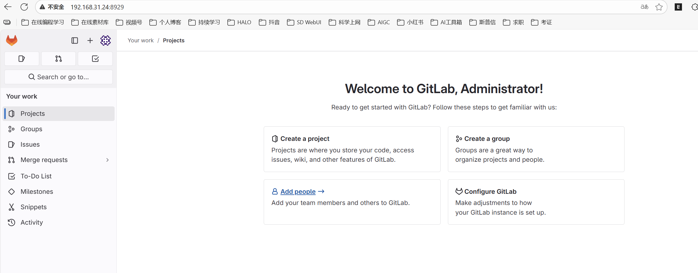


## 4、安装 Maven和JDK17

Maven下载地址：`https://dlcdn.apache.org/maven/maven-3/3.8.9/binaries/apache-maven-3.8.9-bin.tar.gz`

JDK17下载地址：`https://download.oracle.com/java/17/archive/jdk-17_linux-x64_bin.tar.gz`

### 上传部署包到目标服务器

~~~ shell
# 放到root目录下
[root@jenkins-31-171 local]# ls -ltr /root/
总用量 184436
-rw-r--r--  1 root root 180555480  8月 28 11:20 jdk-17_linux-x64_bin.tar.gz
-rw-r--r--  1 root root   8296518  8月 28 11:23 apache-maven-3.8.9-bin.tar.gz

# 解压并改名
tar -zxvf apache-maven-3.8.9-bin.tar.gz -C /usr/local/
tar -zxvf jdk-17_linux-x64_bin.tar.gz -C /usr/local/
cd /usr/local/
mv jdk-17/ jdk
mv apache-maven-3.8.9/ maven

~~~

### 配置maven的仓库地址

~~~ shell
# 配置文件
vim /usr/local/maven/conf/settings.xml
    <mirror>
      <id>aliyunmaven</id>
      <mirrorOf>*</mirrorOf>
      <name>阿里云公共仓库</name>
      <url>https://maven.aliyun.com/repository/public</url>
    </mirror>

~~~

### 配置Java JDK

~~~ shell
# 配置文件
vim /usr/local/maven/conf/settings.xml
    <profile>
       <id>jdk17</id>
       <activation>
           <activeByDefault>true</activeByDefault>
           <jdk>17</jdk>
       </activation>
       <properties>
          <maven.compiler.source>17</maven.compiler.source>
          <maven.compiler.target>17</maven.compiler.target>
          <maven.compiler.compilerVersion>17</maven.compiler.compilerVersion>
       </properties>
    </profile>
  </profiles>

  <!-- activeProfiles
   | List of profiles that are active for all builds.
   |
  <activeProfiles>
    <activeProfile>alwaysActiveProfile</activeProfile>
    <activeProfile>anotherAlwaysActiveProfile</activeProfile>
  </activeProfiles>
  -->
  <activeProfiles>
    <activeProfile>jdk17</activeProfile>
  </activeProfiles>

~~~

## 5、安装Jenkins

- 登录官网Jenkins.io上下载对应的Jenkins镜像

~~~ shell
docker pull jenkins/jenkins:2.462.3-lts
~~~

- 使用docker-compose部署Jenkins

~~~ shell
mkdir -p  /usr/local/docker/jenkins_docker
cd /usr/local/docker/jenkins_docker
vim docker-compose.yaml
services:
  jenkins:
    image: jenkins/jenkins:2.462.3-lts
    container_name: jenkins
    ports:
      - 8080:8080
      - 50000:50000
    volumes:
      - ./data/:/var/jenkins_home/
      
[root@jenkins-31-171 jenkins_docker]# docker-compose up -d
[+] Running 2/2
 ✔ Network jenkins_docker_default  Created                                                                                                                                       0.0s
 ✔ Container jenkins               Started                                                                                                                                       0.3s
[root@jenkins-31-171 jenkins_docker]# docker logs -f jenkins
INSTALL WARNING: User:  missing rw permissions on JENKINS_HOME: /var/jenkins_home
touch: cannot touch '/var/jenkins_home/copy_reference_file.log': Permission denied
Can not write to /var/jenkins_home/copy_reference_file.log. Wrong volume permissions?
[root@jenkins-31-171 jenkins_docker]# ls -tlr
总用量 4
-rw-r--r-- 1 root root 185  8月 28 11:51 docker-compose.yaml
drwxr-xr-x 2 root root   6  8月 28 11:51 data
[root@jenkins-31-171 jenkins_docker]# chmod -R  777 data
[root@jenkins-31-171 jenkins_docker]# docker-compose up -d
[root@jenkins-31-171 jenkins_docker]# docker logs -f jenkins
INSTALL WARNING: User:  missing rw permissions on JENKINS_HOME: /var/jenkins_home
touch: cannot touch '/var/jenkins_home/copy_reference_file.log': Permission denied
Can not write to /var/jenkins_home/copy_reference_file.log. Wrong volume permissions?
Running from: /usr/share/jenkins/jenkins.war
webroot: /var/jenkins_home/war
2025-08-28 03:52:19.721+0000 [id=1]     INFO    winstone.Logger#logInternal: Beginning extraction from war file
2025-08-28 03:52:20.611+0000 [id=1]     WARNING o.e.j.s.handler.ContextHandler#setContextPath: Empty contextPath
2025-08-28 03:52:20.664+0000 [id=1]     INFO    org.eclipse.jetty.server.Server#doStart: jetty-10.0.24; built: 2024-08-26T17:58:21.070Z; git: d5384207795da96fad32db8ea8d26b69955bcc03; jvm 17.0.12+7
2025-08-28 03:52:21.016+0000 [id=1]     INFO    o.e.j.w.StandardDescriptorProcessor#visitServlet: NO JSP Support for /, did not find org.eclipse.jetty.jsp.JettyJspServlet
2025-08-28 03:52:21.050+0000 [id=1]     INFO    o.e.j.s.s.DefaultSessionIdManager#doStart: Session workerName=node0
2025-08-28 03:52:21.538+0000 [id=1]     INFO    hudson.WebAppMain#contextInitialized: Jenkins home directory: /var/jenkins_home found at: EnvVars.masterEnvVars.get("JENKINS_HOME")
2025-08-28 03:52:21.655+0000 [id=1]     INFO    o.e.j.s.handler.ContextHandler#doStart: Started w.@58860997{Jenkins v2.462.3,/,file:///var/jenkins_home/war/,AVAILABLE}{/var/jenkins_home/war}
2025-08-28 03:52:21.670+0000 [id=1]     INFO    o.e.j.server.AbstractConnector#doStart: Started ServerConnector@5c530d1e{HTTP/1.1, (http/1.1)}{0.0.0.0:8080}
2025-08-28 03:52:21.684+0000 [id=1]     INFO    org.eclipse.jetty.server.Server#doStart: Started Server@1c6804cd{STARTING}[10.0.24,sto=0] @2329ms
2025-08-28 03:52:21.686+0000 [id=26]    INFO    winstone.Logger#logInternal: Winstone Servlet Engine running: controlPort=disabled
2025-08-28 03:52:21.870+0000 [id=34]    INFO    jenkins.InitReactorRunner$1#onAttained: Started initialization
2025-08-28 03:52:21.888+0000 [id=35]    INFO    jenkins.InitReactorRunner$1#onAttained: Listed all plugins
2025-08-28 03:52:22.496+0000 [id=34]    INFO    jenkins.InitReactorRunner$1#onAttained: Prepared all plugins
2025-08-28 03:52:22.499+0000 [id=36]    INFO    jenkins.InitReactorRunner$1#onAttained: Started all plugins
2025-08-28 03:52:22.507+0000 [id=33]    INFO    jenkins.InitReactorRunner$1#onAttained: Augmented all extensions
2025-08-28 03:52:22.645+0000 [id=39]    INFO    jenkins.InitReactorRunner$1#onAttained: System config loaded
2025-08-28 03:52:22.645+0000 [id=39]    INFO    jenkins.InitReactorRunner$1#onAttained: System config adapted
2025-08-28 03:52:22.646+0000 [id=39]    INFO    jenkins.InitReactorRunner$1#onAttained: Loaded all jobs
2025-08-28 03:52:22.647+0000 [id=39]    INFO    jenkins.InitReactorRunner$1#onAttained: Configuration for all jobs updated
2025-08-28 03:52:22.675+0000 [id=52]    INFO    hudson.util.Retrier#start: Attempt #1 to do the action check updates server
2025-08-28 03:52:22.916+0000 [id=39]    INFO    jenkins.install.SetupWizard#init:

*************************************************************
*************************************************************
*************************************************************

Jenkins initial setup is required. An admin user has been created and a password generated.
Please use the following password to proceed to installation:

e0127ee5810548959b3b175c3fca7545

This may also be found at: /var/jenkins_home/secrets/initialAdminPassword

*************************************************************
*************************************************************
*************************************************************

2025-08-28 03:52:29.800+0000 [id=39]    INFO    jenkins.InitReactorRunner$1#onAttained: Completed initialization
2025-08-28 03:52:29.878+0000 [id=25]    INFO    hudson.lifecycle.Lifecycle#onReady: Jenkins is fully up and running
2025-08-28 03:52:31.681+0000 [id=52]    INFO    h.m.DownloadService$Downloadable#load: Obtained the updated data file for hudson.tasks.Maven.MavenInstaller
2025-08-28 03:52:31.682+0000 [id=52]    INFO    hudson.util.Retrier#start: Performed the action check updates server successfully at the attempt #1


~~~

- Jenkins密码在日志中  `e0127ee5810548959b3b175c3fca7545`

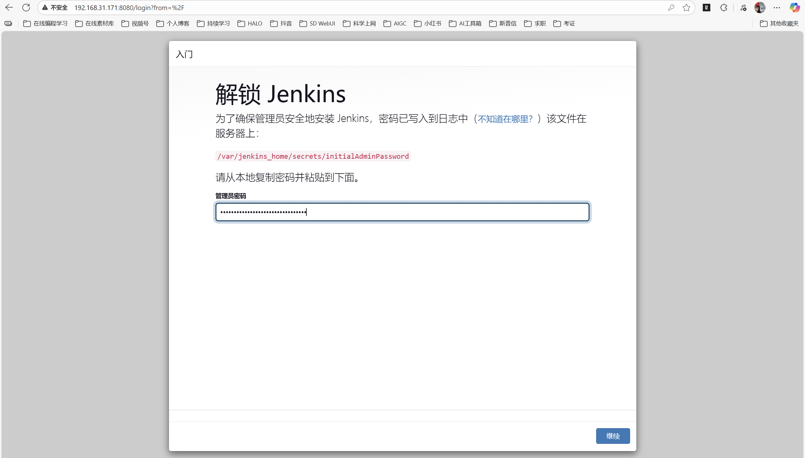

> 继续之后，选择-选择插件来安装-保持默认安装

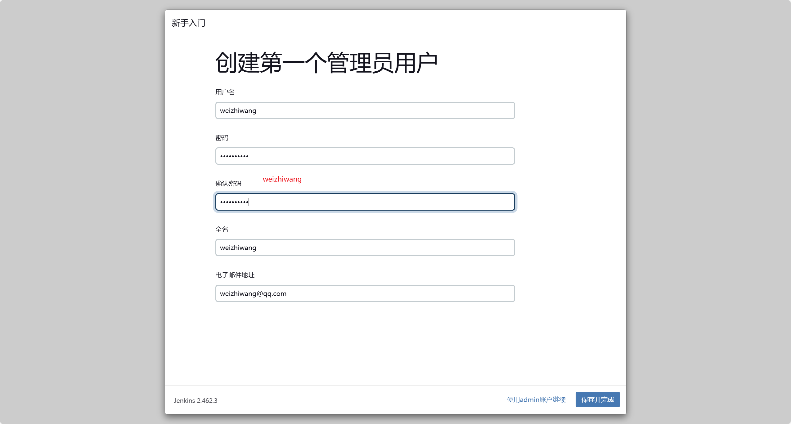

http://192.168.31.171:8080/

## 6、安装插件

1. Git Parameter
2. Publish Over SSH

## 7、在Jenkins中配置JDK和maven

~~~ shell 
mv /usr/local/jdk /usr/local/docker/jenkins_docker/data/
mv /usr/local/maven /usr/local/docker/jenkins_docker/data/
~~~

在Jenkins的全局配置中，手动添加安装的JDK，JAVA_HOME 填写容器内的路径

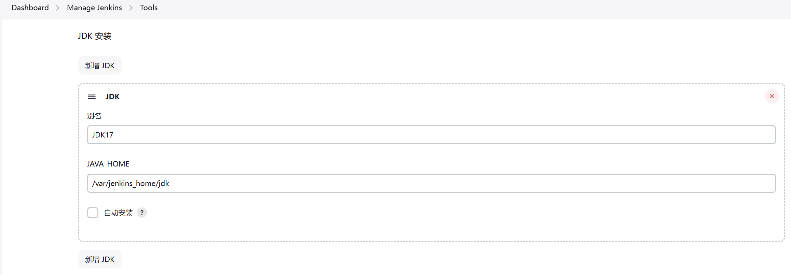

在Jenkins的全局配置中，手动添加安装的maven，MAVEN_HOME 填写容器内的路径

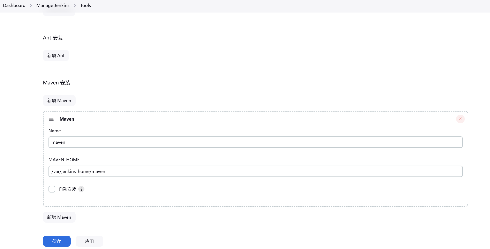

在系统配置中，配置远端接收项目的服务器，采用root 密码的方式连接。填写目录时，必须先创建

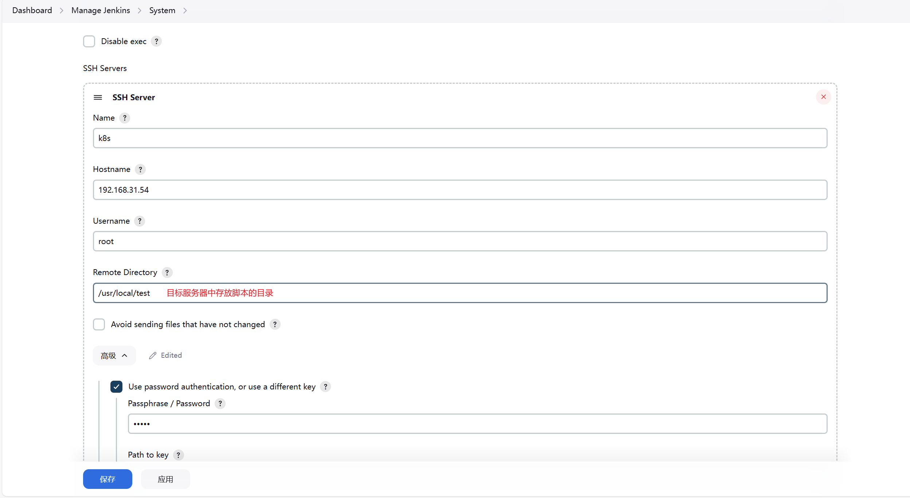

## 8、搭建本地环境

软件：vscode + maven + git

maven：`https://dlcdn.apache.org/maven/maven-3/3.9.11/binaries/apache-maven-3.9.11-bin.zip`

git：`https://github.com/git-for-windows/git/releases/download/v2.51.0.windows.1/Git-2.51.0-64-bit.exe`  傻瓜式安装

详情请参考：[超详细的VsCode创建SpringBoot项目(图文并茂)_vscode创建spring boot项目-CSDN博客](https://blog.csdn.net/zyd573803837/article/details/109263219)

## 9、使用Jenkins拉取gitlab代码

#### 9.1 创建一个自由风格的项目，并且在源码管理中添加git

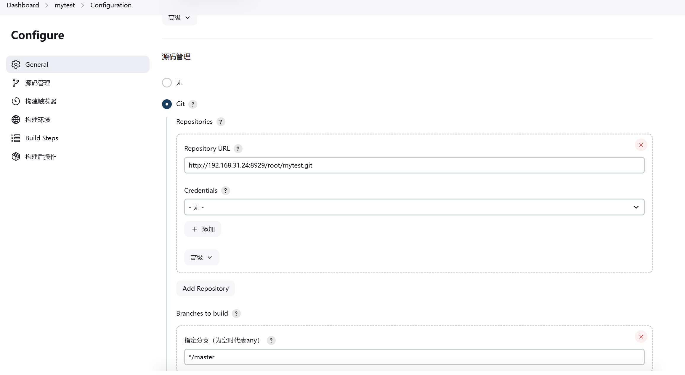

#### 9.2 点击立即构建，把gitlab仓库的代码拉到本地

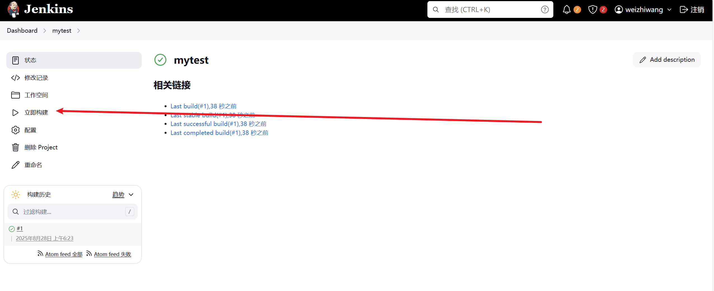

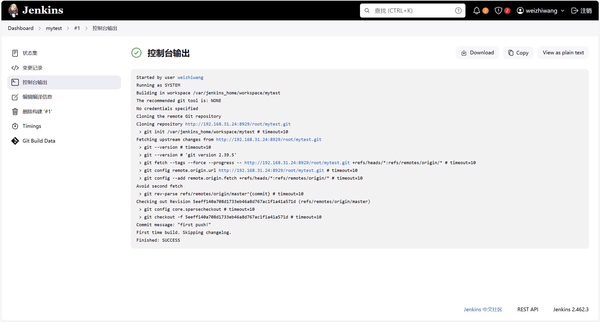

可以在Jenkins服务器的data/workspace中查看到

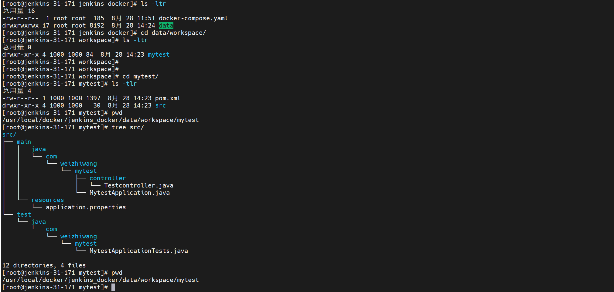

## 10、在拉取gitlab代码的同时，推送到目标服务器

#### 10.1 添加构建操作

使用已安装的maven

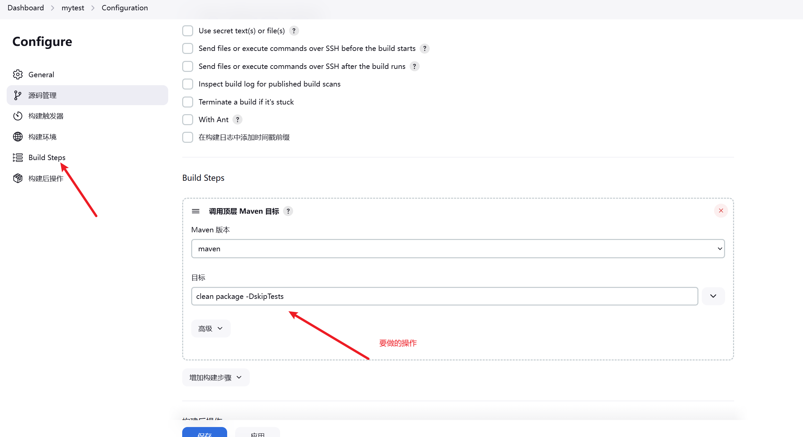

#### 10.2 点击立即构建

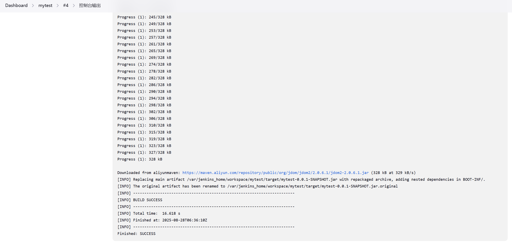

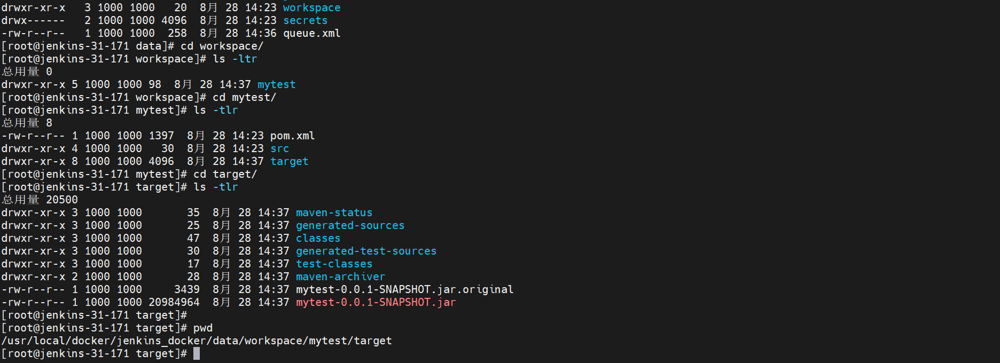

#### 10.3 添加构建后操作-把jar包推送到k8s服务器

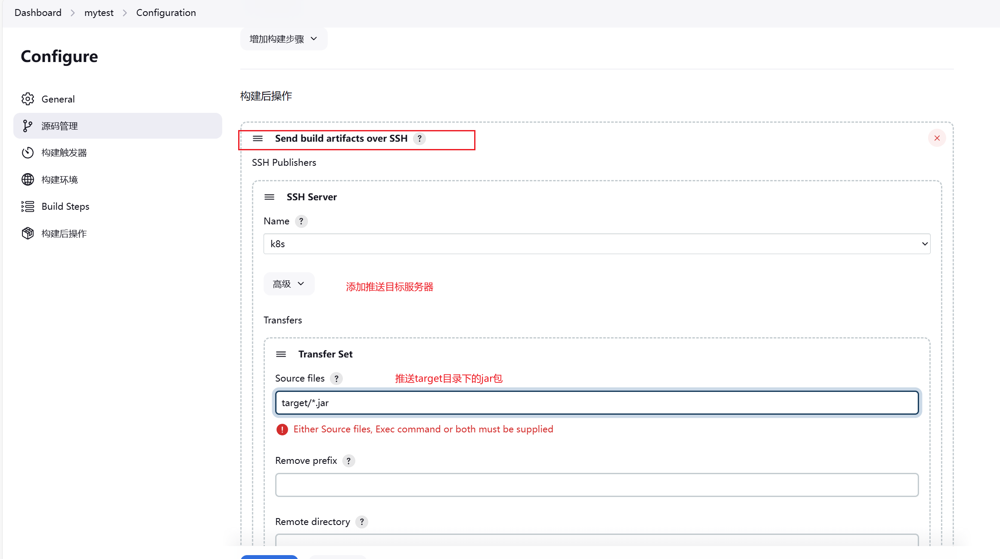

#### 10.4 登录k8s服务器查看目标文件

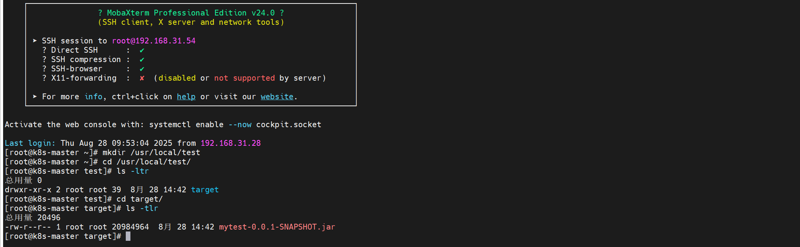

#### 10.5 使用docker-compose的方式发布服务

~~~ shell
# 在项目中创建docker目录，并创建Dockerfile文件和docker-compose.yaml文件

# Dockerfile
FROM eclipse-temurin:17-jdk-jammy
COPY mytest.jar /usr/local/
WORKDIR /usr/local
CMD java -jar mytest.jar

# docker-compose.yaml
services:
  mytest:
    build: 
      context: ./
      dockerfile: Dockerfile
    image: mytest:v1.0.0
    container_name: mytest
    ports:
      - 8081:8080
~~~

Jenkins配置构建后操作

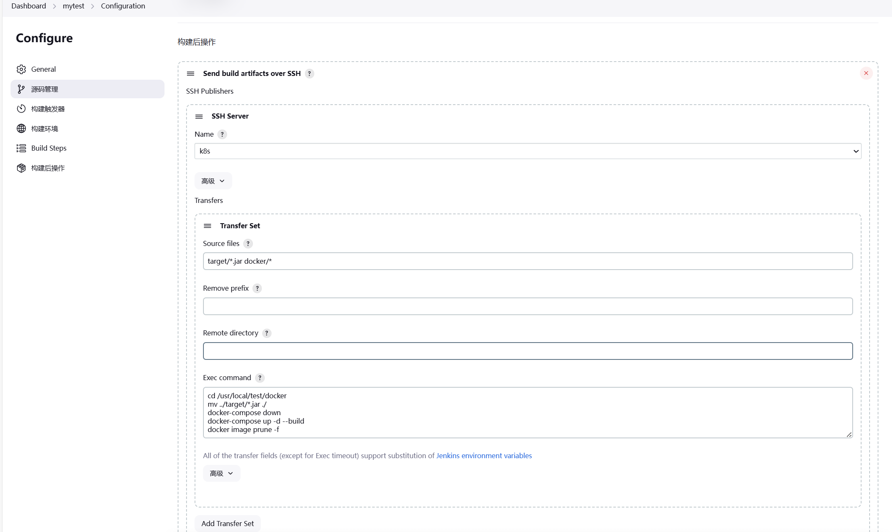

点击立即构建之后，浏览器访问服务

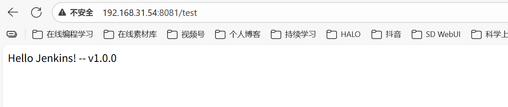

## 11、Jenkins基于参数构建

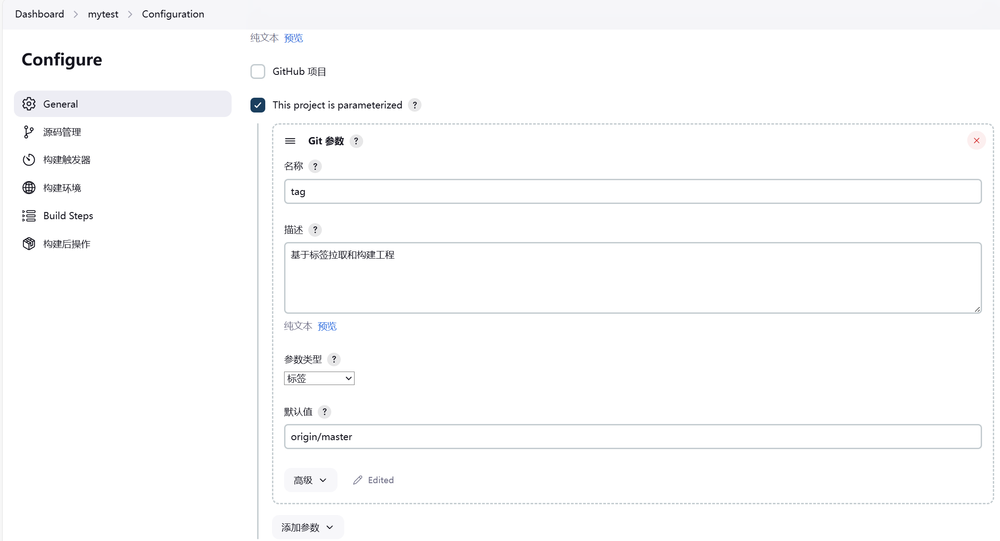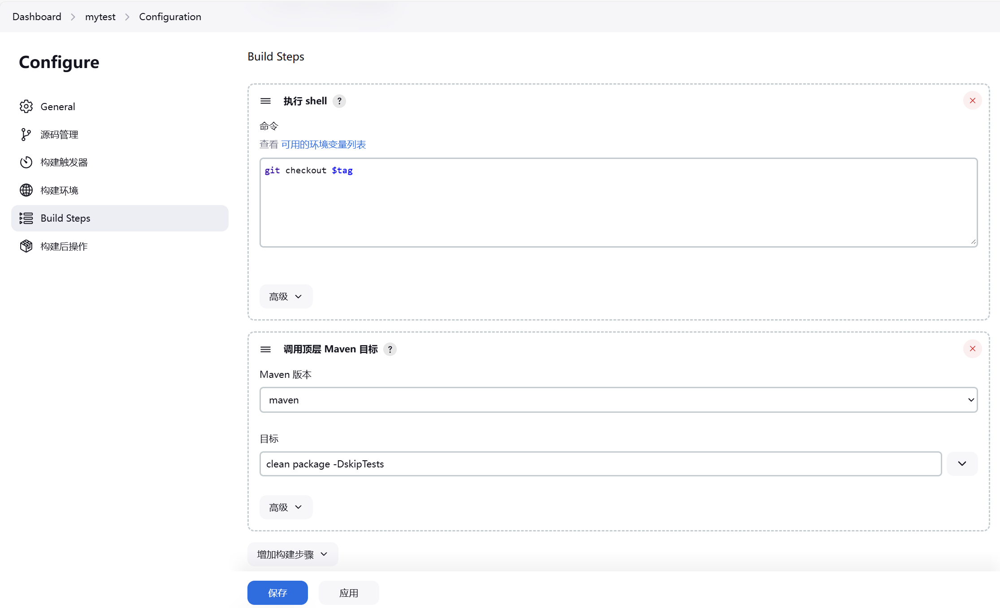

## 12、Jenkins容器内部使用Docker

~~~ shell
# 找到docker.sock文件，把所属组改成root。给其他人添加读和写权限
cd /run/
chown root:root docker.sock
chmod o+rw docker.sock

[root@jenkins-31-171 jenkins_docker]# cat docker-compose.yaml
services:
  jenkins:
    image: jenkins/jenkins:2.462.3-lts
    container_name: jenkins
    ports:
      - 8080:8080
      - 50000:50000
    volumes:
      - ./data/:/var/jenkins_home/
      - /run/docker.sock:/run/docker.sock
      - /usr/bin/docker:/usr/bin/docker
      - /etc/docker/daemon.json:/etc/docker/daemon.json

~~~

